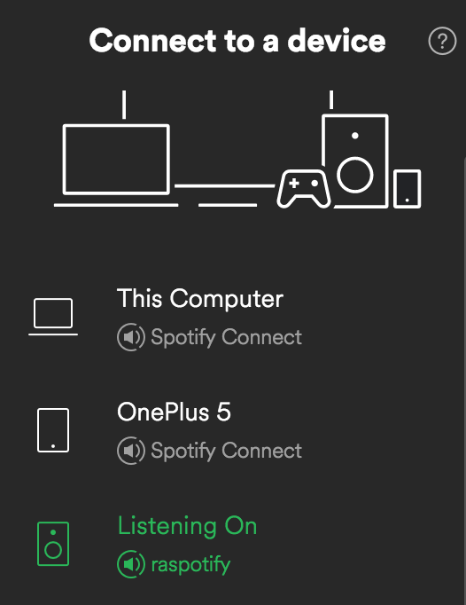

# rpi-spotify
[](https://hub.docker.com/r/flaviostutz/rpi-spotify)
[](https://hub.docker.com/r/flaviostutz/rpi-spotify)

[](https://microbadger.com/images/flaviostutz/rpi-spotify "Get your own version badge on microbadger.com")
[](https://microbadger.com/images/flaviostutz/rpi-spotify "Get your own image badge on microbadger.com")

You can use this container to create a Spotify Speaker at your home, but you must have a Spotify Premium account.

The process run is [librespot](https://github.com/plietar/librespot), an open source client library for Spotify.
This docker container image leverages the work from [David Cooper](https://dtcooper.github.io/raspotify).

For more info on configuring your Raspberry Pi for this to work, go to https://github.com/flaviostutz/ambience-sound

## Prerequisites

* A Raspberry Pi (tested on RPi2/3)
* Docker
* docker-compose

## Usage

* Create file docker-compose.yml

```yml
version: "3.3"
services:
  rpi-spotify:
    image: flaviostutz/rpi-spotify
    network_mode: host
    restart: always
    devices:
      - /dev/snd:/dev/snd
    environment:
      - SPOTIFY_NAME=MyHouse
      - EQUALIZATION=rock
```

* If you want to use pulseaudio:
```yml
version: "3.3"
services:
  rpi-spotify:
    image: flaviostutz/rpi-spotify
    network_mode: host
    restart: always
    environment:
      - SPOTIFY_NAME=MyHouse
      - EQUALIZATION=rock
      - BACKEND_NAME=alsa
      - DEVICE_NAME=pulse
      - PULSE_SERVER=127.0.0.1
```

* Run ```docker-compose up -d```

* Open Spotify App and click on a speaker icon (Connect to a device)

* Select the speaker "MyHouse"

* Enjoy!


## ENVs

* SPOTIFY_NAME: Specifies the name of this speaker (shown in Spotify client)

* DEVICE_NAME: PCM output io device to which the sound will be output using ALSA. Defaults to 'equal' so that you can configure alsa equalization. In this case, configure the target hw using "ALSA_SLAVE_PCM". If empty, will try to get the first available device. If defined to a hardware (eg. "hw:0,0"), equalization won't take place. Use 'pulse' for pulseaudio and specify the server in PULSE_SERVER.

* ALSA_SLAVE_PCM: slave device as configured in alsa to which the sound will be sent to. eg. use 'plughw:0,0' for device at card 0, sub 0"

* ALSA_SOUND_LEVEL: overall sound level on ALSA output. defaults to 100% so that usb sound noises are reduced because there will be needed less amplification

* EQUALIZATION: an equalization profile name or a series of 10 space separated values from 0-100 (one for each equalizer bin)
  * profile names: flat, classical, club, dance, bass, treble, live, party, pop, rock, techno
  * bins example: "90 87 87 82 80 80 82 83 91 95"
  * if you wish to interactively test the best equalization parameters, execute ```docker-compose exec rpi-spotify alsamixer -D equal```. On the next screen play with each equalization params, get the desired bin values and set this ENV parameter accordingly as in the example above

* PULSE_SERVER Defines where the pulse server is. See: https://wiki.archlinux.org/index.php/PulseAudio/Configuration

## Development

Auto build doesn't work on Docker Hub because it is a cross compilation on RPI. You have to build the image locally and push it manually

```shell
docker-compose build
docker login
docker push flaviostutz/rpi-spotify
```

## Screenshots


